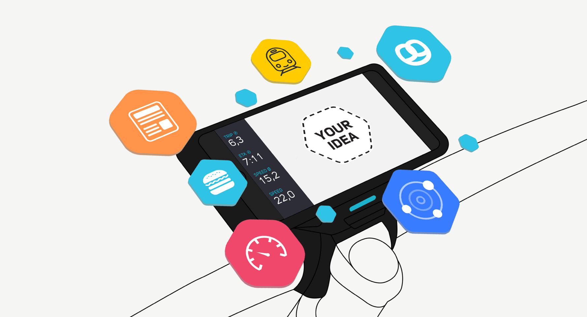
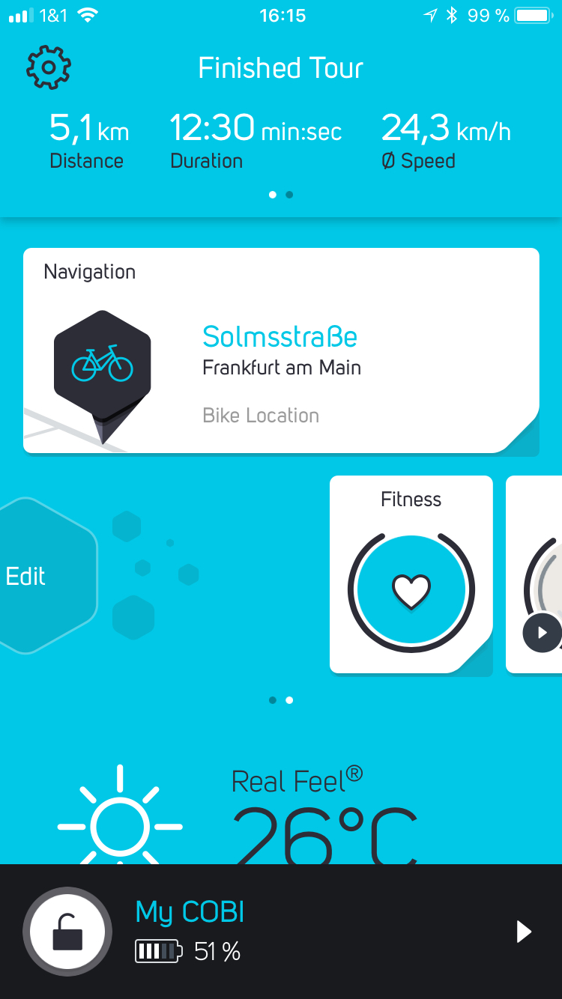
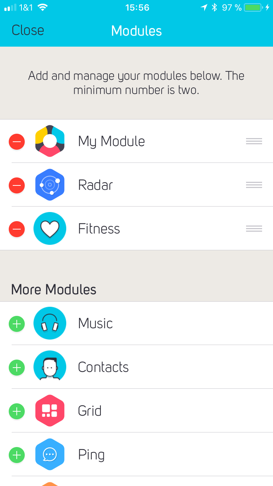
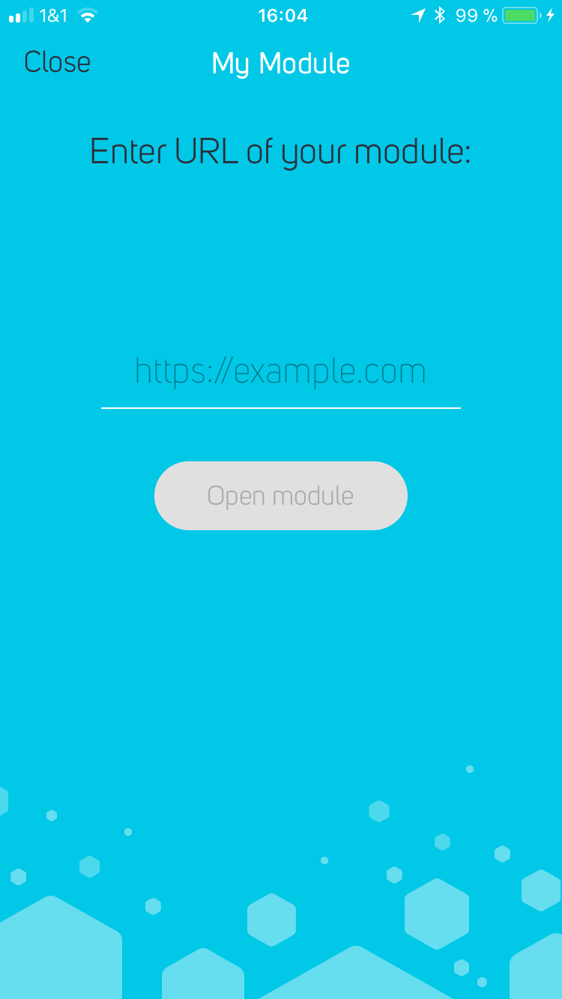
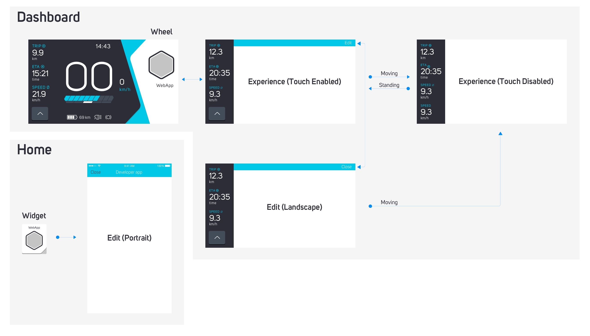

# COBI DevKit

A collection of Open Source components to develop [modules](https://cobi.bike/devkit) for [COBI](https://cobi.bike) – the perfect fusion of smartphone and bike.



## 💡 Interactive Demo: Learn the fundamentals


The quickest way to learn the COBI DevKit basics without writing any code. 

[](https://codepen.io/cobi-bike/pen/VzBOqp?editors=0010)


Change location coordinates and hit thumb controller buttons to see COBI.js in action. This simulates data and interaction events that will later be provided by the COBI system when riding a bike. Bonus points for directly tweaking the code e.g. subscribing to additional data from the COBI.js data stream.


## 🚀 Let's get started with your first project

It only takes a few lines of javascript to turn Web Apps into a COBI module:

### Step 1: Add boilerplate code

To get your Web App ready just add `cobi.js` at the end of the body section of your HTML:
```html
<script src="https://cdn.cobi.bike/cobi.js/0.34.1/cobi.js"></script>
```

and pass an authentication token to COBI before subscribing to the data stream. 
COBI doesn't issue tokens yet, so you can use any string for now: 
```javascript

// Authenticate your module
COBI.init('token — can by anything right now')
```

It's that easy: Any Web App + COBI.js = __COBI Module__!

### Step 2: Hook into the data stream

Enough with the boilerplate code, let's make our new COBI module respond to the [handlebar remote control](https://cobi-bike.github.io/COBI.js/#cobihubexternalinterfaceactionsubscribe):

```javascript
COBI.hub.externalInterfaceAction.subscribe(function(action) {
  alert('I just tapped the handlebar remote and instantly received this ' + action + ' in my Web App');
});
```

or visualize the [cadence](https://cobi-bike.github.io/COBI.js/#cobirideservicecadencesubscribe) acquired by COBI from an external Bluetooth sensor or e-bike motor:

```javascript
COBI.rideService.cadence.subscribe(function(cadence) {
    console.log('Your current cadence is ' + cadence + ' rpm.');
});
```

There is a ton of data available such as current speed, course, heart-rate (if heart-rate monitor is connected), power, calories burned and much more. Our [COBI.js reference](https://cobi-bike.github.io/COBI.js/) will be your friend.

## 🔬 Test your module

Now that you have supercharged your Web App, you can test your module either in the Chrome browser on your machine or directly in the COBI iOS App on your bike.

### Browser testing

Just install the [COBI DevKit Chrome Extension](https://chrome.google.com/webstore/detail/cobi-devkit-simulator/hpdhkapigojggienmiejhblkhenjdbno), open up the Developer Tools (⌘ + Option + i / Ctrl + Shift + j) and select the »COBI« tab.  
To get the best experience, switch on the phone mode in the upper left corner and rotate the device to landscape.
To simulate riding and fitness data you can play back one of our [sample cobitrack or GPX files](https://github.com/cobi-bike/DevKit-Simulator/tree/master/tracks).

### On-bike testing 

If you don't own a COBI yet, apply for a hardware development kit at [cobi.bike/devkit](https://cobi.bike/devkit) or purchase one at [get.cobi.bike](https://get.cobi.bike). Afterwards, register as a COBI developer to test your module on your bike. 

[](https://my.cobi.bike/developer)

Ready? Then open up the COBI App on your iPhone and open the edit modules screen. As COBI developer you can now choose from a number of examples modules or add you own via »My Module«

When you open »My Module« on the home screen or the dashboard, you can enter the URL of your module (it can be hosted wherever you want, but we have some suggestions [below](#other-tools--resources)). When you press »Open module« your module is loaded and hooked up to the COBI App. Now you can easily test your idea on your 🚲.

  

## 🏓 Play ping-pong with the COBI App

Take advantage of interfaces to the native COBI app to save yourself a lot of work.

#### Start a turn-by-turn navigation to a destination:
```javascript
COBI.navigationService.control.write({
  'action': 'START', 
  'destination': {'latitude': 50.110924,'longitude': 8.682127}
})
```
#### Open a phone number picker with the list of contacts:
```javascript
COBI.app.contact.read()
```
#### Hook into the voice feedback system:
```javascript
COBI.app.textToSpeech.write({'content' : 'Can you hear my voice?', 'language' : 'en-US'})
```
#### Claim the entire screen space by hiding the clock in the top right corner:
```javascript
COBI.app.clockVisible.write(false);
```
#### Claim all Thumb Controller buttons on e-bikes that are reserved for motor control by default:
```javascript
COBI.devkit.overrideThumbControllerMapping.write(true);
```

Check out the [COBI.js reference](https://cobi-bike.github.io/COBI.js/) for more.

## 🎛 Settings for your Module

A module can be shown in different states. There are three pieces of information that you should adapt to:

1. The device orientation — your module should automatically adapt to the available screen size
1. The value of `COBI.parameters.state()` — can be either `COBI.state.edit` or `COBI.state.experience`
1. The state of `COBI.app.touchInteractionEnabled` — changes when you start/stop riding  

### Flexible layout

Take a look at our [COBI DevKit UI Components](https://github.com/cobi-bike/DevKit-UI) for an easy way to create a UI for your settings.

### Module state

Right now, there are two states you should support. You can check `COBI.parameters.state()` at any time to decide if some sort of settings should be shown (`COBI.state.edit`) or if the actual module is requested (`COBI.state.experience`). To share information between the two states and in between user sessions use the web standard [Local Storage](https://html.spec.whatwg.org/multipage/webstorage.html#the-localstorage-attribute).

### Touch Interaction Changes

While riding, the user is encouraged to use the thumb controller instead of interacting with the UI via touch. Subscribe to changes of this state to make the best out of both situations. Please note that a bar is shown at the top while `touchInteractionEnabled` is `false` — make sure it is not overlapping with your UI.

```javascript
COBI.app.touchInteractionEnabled.subscribe(function(enabled) {
    // Adapt your UI
});
```



## 🌈 Everything else about the COBI DevKit

### Debugging tips & tricks

* To get better error messages when interacting with the `cobi.js` API, include `https://cdn.cobi.bike/cobi.js/0.34.1/cobi.dev.js` instead of the script mentioned above (**please note:** the dev version is considerably larger which has a big impact on the loading time)
* To show a native dialog when running inside the iOS App, execute `console.warn("COBI", "your messages")` (only use for debugging)
* When developing in Chrome, use the phone button in the upper left corner of the Chrome Developer Tools and rotate it to landscape to see how it looks while riding 
* When using the Chrome Simulator, press the `Print state to console` button to print the current `cobi.js` state to the Chrome Developer Tools Console

### Inspiration & Examples

* Get inspired by our showcases on the [COBI DevKit site](https://cobi.bike/devkit)
* Take a testride with one of our example modules in the COBI iOS app. Requires registration as a developer on [my.cobi.bike](https://my.cobi.bike)
* Visit our [Showtime Developer Forum](https://forums.cobi.bike/c/showtime) for additional inspiration from the developer community

### Interface Guidelines

Read our [Interface Guidelines](interface-guidelines.md) to understand the unique challenges of developing software for bikes and to learn more about how the COBI system and modules work.

### More DevKit Resources

- [FAQ](FAQ.md)
- [Developer Forums](https://forums.cobi.bike)
- [COBI DevKit Chrome Extension on Chrome Web Store](https://chrome.google.com/webstore/detail/cobi-devkit-simulator/hpdhkapigojggienmiejhblkhenjdbno)
- [COBI DevKit Chrome Extension on Github](https://github.com/cobi-bike/COBI.js-simulator)
- [COBI DevKit UI Components](https://github.com/cobi-bike/DevKit-UI)
- [COBI.js reference](https://cobi-bike.github.io/COBI.js/)

### Other Tools & Resources

- [Glitch](https://glitch.com/) – friendly community where you'll build the app of your dreams
- [CodePen](https://codepen.io/) – social development environment for front-end designers and developers

## 👏 Contributing to this project

Anyone and everyone is welcome to contribute to this project, the [DevKit Simulator](https://github.com/cobi-bike/DevKit-Simulator) and the [COBI DevKit UI Components](https://github.com/cobi-bike/DevKit-UI). Please take a moment to review the [guidelines for contributing](CONTRIBUTING.md).

* [Bug reports](CONTRIBUTING.md#bugs)
* [Feature requests](CONTRIBUTING.md#features)
* [Pull requests](CONTRIBUTING.md#pull-requests)

Copyright © 2017 COBI GmbH
