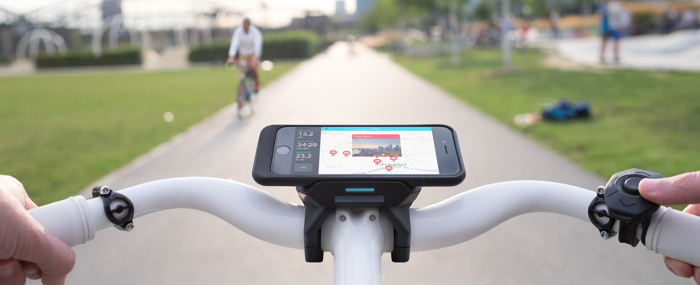

# Interface Guidelines for COBI Modules

The COBI DevKit is the world's first platform that offers everything you need to easily design & build interactive experiences for riding on a bike. The COBI hardware and software takes away all the hard work (e.g. securely mounting and powering the phone, remote control, acquiring sensor-, eBike- and riding data) so that developers can fully focus on bringing new experiences to life with a stream of riding data and a fullscreen canvas embedded in the COBI dashboard:

Introducing _COBI Modules_.

## Understanding the Biking Context

COBI enables developers to design interactive modules that are loved by users while keeping them safe on the road. This is breaking new territory for developers and UX designers – so it's all the more important to understand this challenging new context:

* Directly interacting with a phone on the road (by using the touchscreen) is dangerous and often illegal. A handlebar remote (COBI Thumb Controller or Bosch Remote) is therefore a mandatory component of the COBI system while intuitive button mappings and reassuring feedback should enable effortless interactions.
* Cyclists concerned about battery life may turn the display off temporarily while riding. The good news is that remote control and voice feedback are still available to perform basic interactions and receive feedback.
* Picture the cyclist with hands on the handlebars & eyes on the road while riding. A module must not disturb the riders' focus on traffic and the road ahead. However, the module may provide guidance through voice feedback or glanceable visual hints – any feedback beyond that must be queued for later.
* The cyclist may take short breaks e.g. at traffic lights. Since COBI detects these breaks automatically you can take advantage of them easily and adapt your user interface to accept touch input, allow on-screen keyboards and show more elaborate information that has been queued up during the ride.
* COBI supports both Bikes & E-Bikes, External Sensors (e.g. Cadence & Heart Rate), 4- and 6-Button Thumb Controllers. Make sure to support these configurations to maximize the audience and make the most of the experience of using your module. Our [COBI Simulator](https://github.com/cobi-bike/COBI.js-simulator) makes that easy to test.
* Keep in mind that the phone is mounted on the handlebars and the viewing distance is larger compared to holding it in your hand.

## Guiding Principles

### Keep it bold: Adaptive & Glanceable Design

* Keep your screendesign glanceable – use bold colors, high contrasts and large typography.
* Resize screen elements dynamically when the bike starts moving and hide descriptive elements (like labels) to increase design clarity.
* Design your module to be displayed on Android 4.4+ and iOS 9.0+ devices with screen sizes from 4" up to 6"

### Do not disturb: Non-Intrusive User Interface

* Do not require user feedback while riding at anytime. If important events occur, rely on voice feedback to inform and follow-up as soon as the bike stops moving.
* When designing a game consider pausing automatically when the bike starts moving.

### The screen is optional: Remote Control, Touch & Voice Feedback

* Make the most relevant interactions accessible via Thumb Controller taps while riding.
* Bring in touch and more sophisticated interactions whenever the bike doesn't move.
* Take advantage of voice feedback to enable users to perform actions in your module without looking at the screen.
* Depending on the bike different Thumb Controller buttons are available to your module (indicated by Thumb Controller Type). _Select_ is always available. _Up_ and _Down_ are always available, if [E-Bike drive control is disabled](https://cobi-bike.github.io/COBI.js/#cobidevkitoverridethumbcontrollermappingwrite) by your module. _Left_ and _Right_ are always available on the 6-Button COBI Thumb Controller and Bosch Nyon remote.

### Plan, Ride, Configure, Advise

COBI modules support planning & riding scenarios to keep interaction-heavy planning/configuration tasks separate from the clean, simplistic riding interface. We call the former scenario _Overview_ and the latter _Experience_.

Modules are expected to support the following view states:

#### State 1: Overview (Portrait orientation, optional)

Touch-only interface on the home screen available before the ride.

#### State 2: Experience (Landscape orientation, mandatory)

The main user interface for cyclists on the road. Optimized for use with thumb controller and touch – depending on whether the touch interface is enabled.

#### State 3: Settings (Portrait & Landscape orientation)

Touch-only interface available before and during the ride to tweak module-specific settings

#### State 4: Manual (Portrait & Landscape orientation)

Touch-only interface to learn more about how to use your module.

#### Data Stream

Once loaded, COBI will start feeding riding data (location, speed, fitness data, thumb controller events, etc.) via COBI.js to your module. On closing the module, the data stream will stop and all scripts will be unloaded.

### Offline first

Recreational cycling often takes place in areas with no or weak cell signal. COBI is designed to gracefully handle offline scenarios at all times – so should your module. Take advantage of Web Standards like [Application Cache Manifests](https://html.spec.whatwg.org/multipage/offline.html#manifests) to speed up loading times & enable offline use or [Local Storage](https://html.spec.whatwg.org/multipage/webstorage.html#the-localstorage-attribute) to store application state and user preferences.
